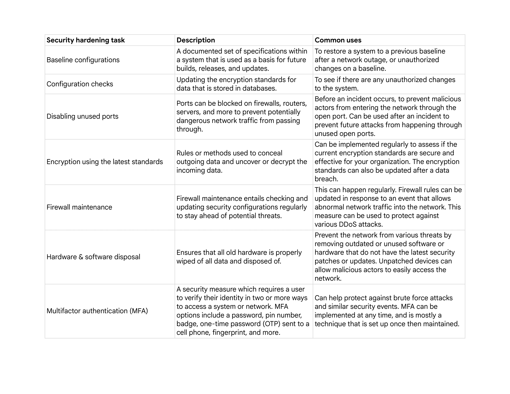
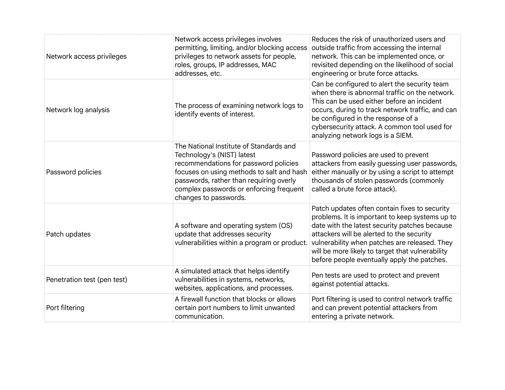
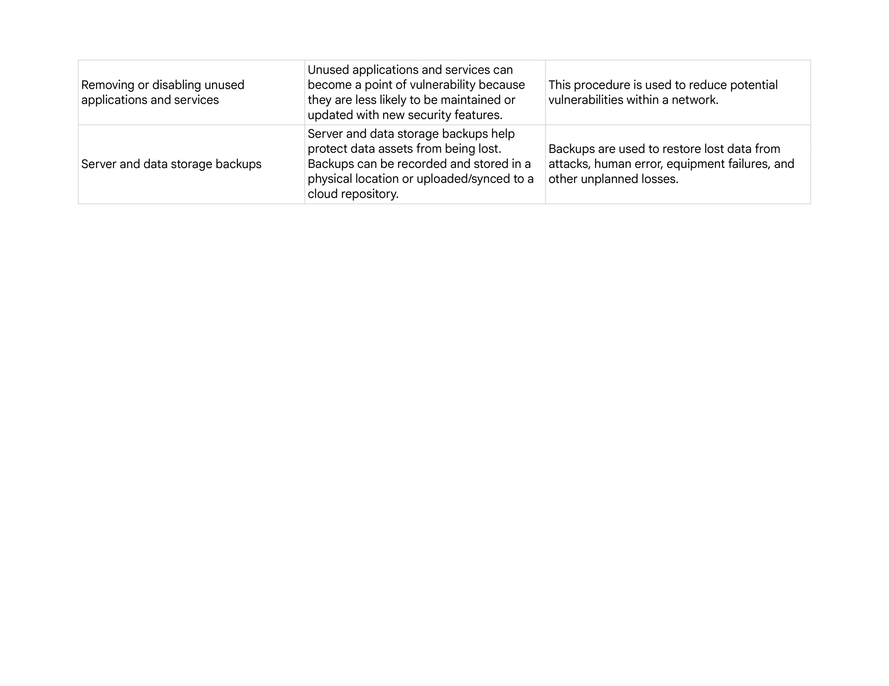
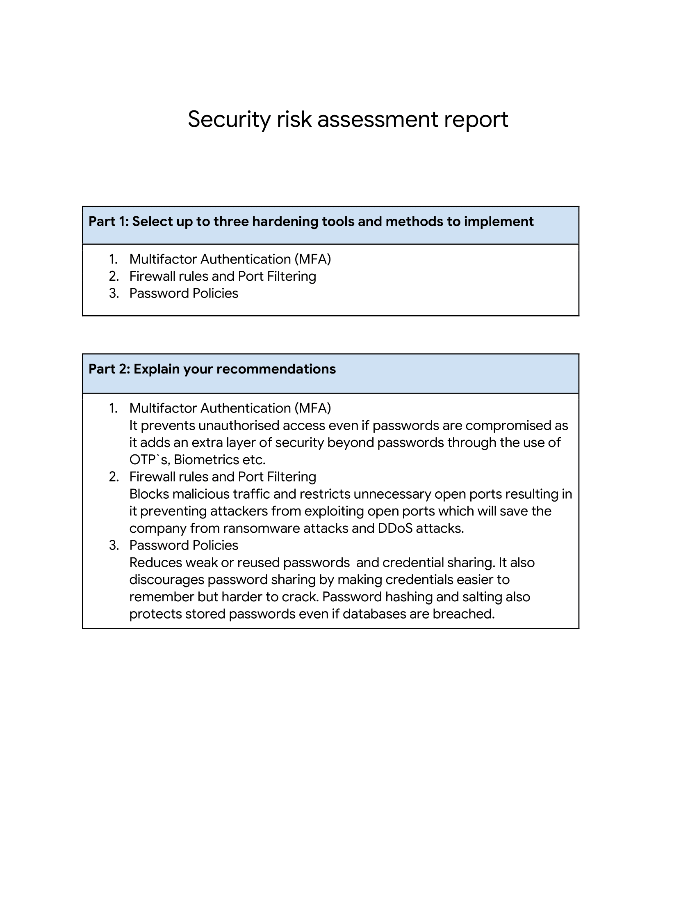

# Security-risk-assessment
In this activity I will analyze a scenario involving a social media organization that suffered a major data breach due to undetected vulnerabilities. My task is to identify common network hardening tools and strategies that can strengthen the organization's security posture and prevent future breaches.
## Scenario

## 

Review the following scenario. Then complete the step-by-step instructions.

You are a security analyst working for a social media organization. The organization recently experienced a major data breach, which compromised the safety of their customers’ personal information, such as names and addresses. Your organization wants to implement strong network hardening practices that can be performed consistently to prevent attacks and breaches in the future. 

After inspecting the organization’s network, you discover four major vulnerabilities. The four vulnerabilities are as follows:

1.  The organization’s employees' share passwords.
    
2.  The admin password for the database is set to the default.
    
3.  The firewalls do not have rules in place to filter traffic coming in and out of the network.
    
4.  Multifactor authentication (MFA) is not used. 
    

If no action is taken to address these vulnerabilities, the organization is at risk of experiencing another data breach or other attacks in the future. 

In this activity, you will write a security risk assessment to analyze the incident and explain what methods can be used to further secure the network.

